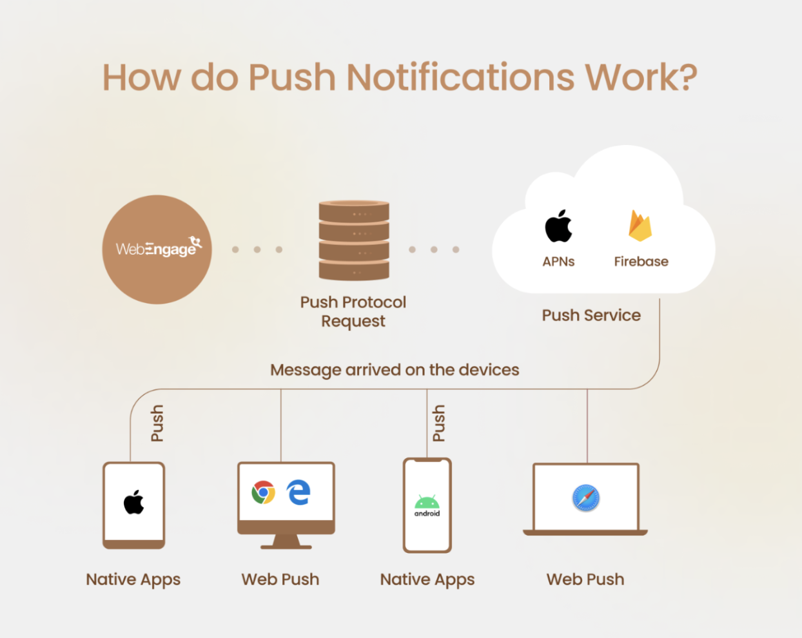
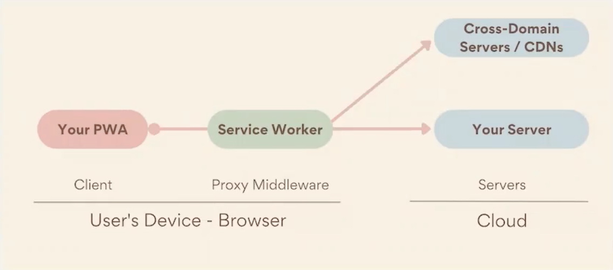

# Push Notifications 

The Runtime Terrors

Demo Page: https://runtime-terrors-techshare.onrender.com/


Unfortunately, our push notifications are not compatible with iOS devices


## Introduction 

Diagram 1


Diagram 2


Diagram 3



## Setting Up Push Notifications:

### main.js - client side

```if ('serviceWorker' in navigator && 'PushManager' in window) {}```
- Check if serviceWorker and PushMagager are supported
    - These services are needed to receive push notifications

```navigator.serviceWorker.register('sw.js')```
- If supported, register service worker code into the browser
- Service worker must be registered when the site is loaded
- Returns a promise --> get a service worker registration object 
    -  Store this object for later use
    - ```swRegistration = swReg;```

```function initializeUI() {}```
- Initialize the user interface
- Set up button for enabling/disabling notifications
- Allow user to subscribe or unsubscribe

```function subscribeUser()```
- Called when a user enables push messaging
-  ```swRegistration.pushManager.subscribe()```
    - Using the previously created service worker registration object
    - Subscribe user to push notification service
    - Returns a promise --> get subscription object
        - Object contains an endpoint used on the server side

```function updateSubscriptionOnServer(subscription) {}```
- Send subscription object to server


### index.js - server side

```const webpush = require('web-push');```
- Using web-push library for node.js

```let subscriptions = [];```
- Creating an temporary array to store subscriptions
- Normally, would store subscriptions in a database

```app.post('/subscribe', (req, res) => {}```
- Subscribe route is used to add a new subscriber
- Initially, get a request sent from client (main.js)
    - Request body contains a subscription object (has an endpoint)
- If subscriber doesn't already exist, add it to the array

```app.post('/push', (req, res, next) => {}```
- Push route is used to send a new push notification on the server side
- Initially, get a request sent from client (main.js)
    - Request body contains notification information
        - Notification message, title, and link
- Loop through subscriptions array
    - Use sendNotification() method from web-push library
        - Takes in a subcription object and a json string
        - Sends the notification to each subscriber (endpoint)
        - The rest is handled by the service worker


### sw.js - client side
- Service Workers act as an intermediary between web server and the web browser 
- Helps to enhance an already existing web application, potentially improving it's functionality, speed, or reliablity. 

- Process: 
    - Use our service worker to subscribe to a Push Service
    - Service worker will now listen for push events
    - If there is an event, service worker awakens and will push that meessage to the client
    
```self.addEventListener('push', function(event) {}```
- What to do when we recieve a push notification
    - NOTE: a push event doesn't necessarily send a notification on default
    - data: event.data.text(): passes our data that was part of the push event into our notification            
    
```self.addEventListener('notificationclick', function(event) {}```
- What happens when you click on notification
    - pull ntoification data from options 
    - wait until event is complete, closes to open a new window with the notification link


```self.addEventListener('push', function(event) {}```
- What occurs when a change has needed to be made pertaining to our subscriptions 
    - every time you reload the page, check if there's a change in subscription
    

## Conclusion
- Is it worth doing all the work “in-house”? 
    - Pros:
        - Customization: Building a push notification system in-house allows for customization.

        - Integration: An in-house system can be easily integrated with other internal systems, making it easier to manage.

        - Control: When building an in-house system, you have complete control over the system and can make changes as needed.

        - Cost savings: Depending on the size of the operation, building an in-house system can be more cost-effective than paying for a third-party solution.

        - Security: With an in-house system, there is more control over data security and sensitive data can be properly protected.

    - Cons:
        - Time-consuming: Developing a push notification system from scratch can be a time-consuming process, taking time away from other important tasks.

        - Maintenance: An in-house system requires ongoing maintenance, including updates and bug fixes.

        - Scalability: An in-house system may not be as scalable as a third-party solution, which can handle a large number of users and notifications.

        - Support: With an in-house system, support is entirely reliant on the internal team, which may not have the resources to provide comprehensive support.

- Alternatives:
    - Third Parties: OneSignal, Firebase Cloud Messaging
    - Frameworks and Libraries: React Native Push Notification, Push.js, and WebPush
    - APIs: Amazon SNS, Twilio can be used to leverage pre-built infrastructure


## Running code locally:
- node index.js

## References:
- https://codelabs.developers.google.com/codelabs/push-notifications#0
- https://clarkio.com/2017/08/22/pwa-web-push-3/
- https://www.npmjs.com/package/web-push
