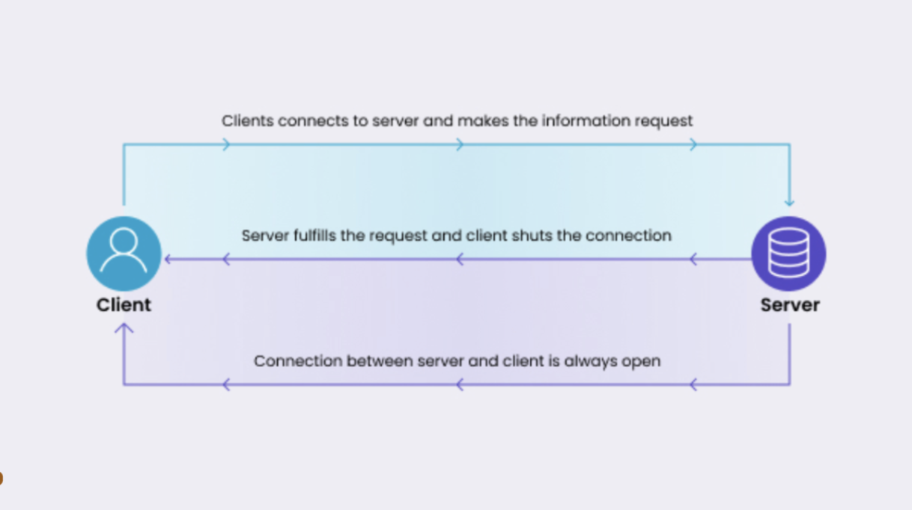

# Push Notifications 

The Runtime Terrors

Demo Page: https://runtime-terrors-techshare.onrender.com/


## Introduction 

Diagram 1


Diagram 2


## Setting Up Push Notifications:

### main.js
- client side

### index.js
- server side

```const webpush = require('web-push');```
- using webpus library (node.js package)

```let subscriptions = [];```
- creating an array to store subscriptions
- normally, would connect this to backend (database)

```app.post('/subscribe', (req, res) => {```
- adding a new subscriber on the server side

```app.post('/push', (req, res, next) => {```
- sending a new push notification on the server side


### sw.js
- service workers


## Running code locally:
- node index.js

## References:
- https://codelabs.developers.google.com/codelabs/push-notifications#0
- https://clarkio.com/2017/08/22/pwa-web-push-3/